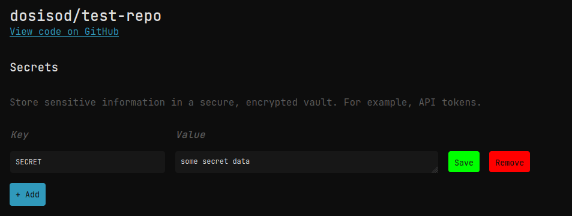
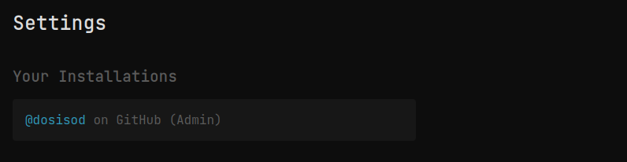
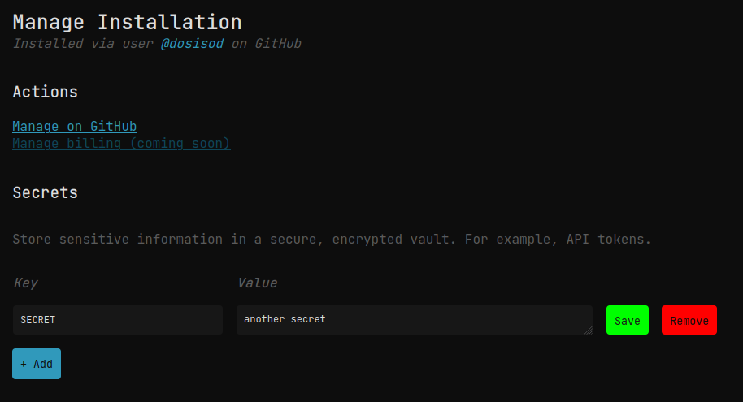

# Secrets

One of the most important part of any CI system is the ability to safely store secrets such
as API tokens or connection strings.

Similar to GitHub, Cicada has a UI for creating and updating secrets, while the secrets themselves can only be
read during the execution of workflow. Cicada supports 2 kinds of secrets: Installation secrets
and repository secrets: Installation secrets are available to all workflows ran in a given installation,
while repository secrets are only available to workflows ran in a particular repository.

## Managing Secrets

To manage repository secrets, click on a repository URL (for example, in from "Recents" page),
and you should end up here:



Here you can create, update, and delete secrets. You cannot view secrets directly as they are only
available when running a workflow.

To create an installation secret, go to the "Settings" page on the dashboard, then find your installation:



Once you click on your installation, you will have a similar screen where you can set installation
secrets:



## Using Secrets

To actually use secrets in your Cicada workflows, use the following syntax:

```
let token = secret.API_TOKEN

# or

shell command --api-token=(secret.API_TOKEN)
```

When Cicada runs your workflow it will pull all the available secrets (installation and repository wide),
and inject them into your workflow. Repository secrets take precedence over installation secrets in the
case that a repository and installation secret of the same name exists.

> Note: workflows will fail if `API_TOKEN` is not set!

The `secret` global is immutable, meaning you cannot reassign a secret value unless you first assign it
to a variable.

## Limitations

There are certain limitations to what secrets can do. Some of these restrictions may be relaxed in the future.

* Keys must be <= 256 characters
* Keys cannot be empty
* Keys must match the regex `[A-Za-z_][A-Za-z0-9_]*` \*
* Values must be <= 1024

\* This is due to how secrets are accessed in Cicada workflows (ie, `secret.ABC`). Once Cicada supports
arbitrary strings as keys this restriction will be lifted.

## Security

Protecting your secrets is our priority. Here are some of the security measures we've taken to ensure
your secrets do not fall into the wrong hands:

* Secrets are encrypted using [HashiCorp Vault](https://www.hashicorp.com/products/vault) via the
  [transit engine](https://developer.hashicorp.com/vault/docs/secrets/transit).
* Secrets are sent to Vault to be encrypted with a key that is stored in Vault, and returned to be stored
  in Cicada in encrypted form. The reverse is done for decryption.
* A separate encryption key is created for each installation and repository, meaning no single key encrypts all the data.
  The encryption algorithm used is AES-GCM with a 256 bit key and 96 bit nonce (the default in Vault).
* Encryption keys auto-rotate every 30 days: The new keys will be used for encrypting any newly created or updated secrets,
  and any old keys will be used to decrypt old secrets. This is done in the background, so no action is required on your part.
* Vault is running on a separate, dedicated server, and uses mTLS to ensure only Cicada is able to
  communicate with it.

> Please note that Cicada has yet to be independently audited for security vulnerabilities. While we try
> our best to ensure that Cicada is safe and secure, we are not security experts, and certain security
> considerations may have been overlooked. Only use secrets if this is an acceptable risk for you and/or
> your organization!
