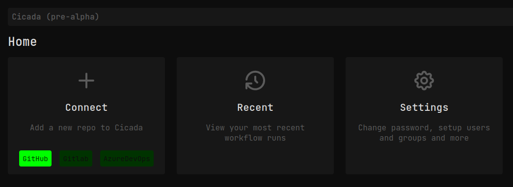

# Getting Started

To get started with Cicada, create an account by [logging in](https://cicada.sh/login) with your GitHub account.

Once you've created your account you will land on a dashboard similar to this one:

Click the "GitHub" button to authorize and connect Cicada to your GitHub repositories. You can allow Cicada
access to a select list of repositories, or to all your repositories if you prefer. You can always come
back and change this later.

Once you've done this you can start writing workflows in Cicada! Click [here](./ci-lang/getting-started.md)
to learn more.
